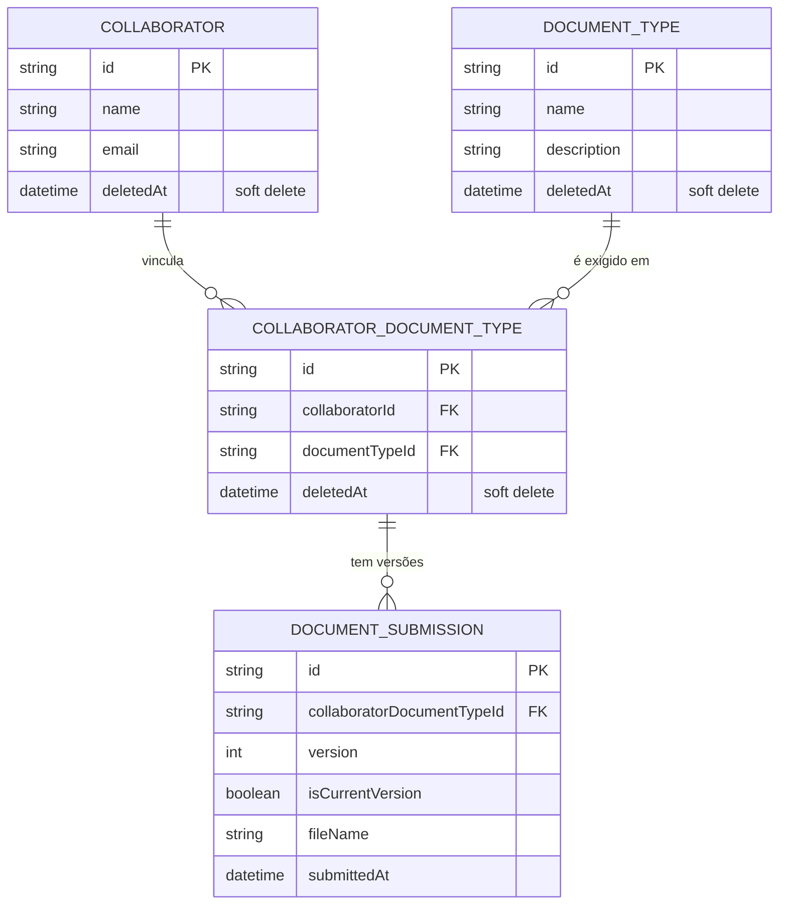

# api-documentacao-colaboradores

[](https://github.com/Leandrodasilvahuber/api-documentacao-colaboradores/actions/workflows/ci.yml)

API em Node.js + TypeScript (Express) para controle de documentos de colaboradores: cadastro de
colaboradores, tipos de documento, vínculo entre eles, envio/histórico de versões de documentos e
estatísticas de completude.

## Visão geral

O domínio da API gira em torno de quatro entidades:

- **Collaborator** — colaborador cadastrado (nome, email). Suporta soft delete (`deletedAt`).
- **DocumentType** — tipo de documento que pode ser exigido de um colaborador (ex.: RG, CPF).
  Também suporta soft delete.
- **CollaboratorDocumentType** — vínculo entre um colaborador e um tipo de documento (indica que
  aquele colaborador precisa enviar aquele documento). Um colaborador pode ter vários tipos de
  documento vinculados, e um vínculo pode ser desfeito (soft delete) e reativado depois.
- **DocumentSubmission** — cada envio de um documento gera uma nova versão vinculada ao
  `CollaboratorDocumentType`; a versão anterior é marcada como não-atual (`isCurrentVersion`),
  preservando o histórico completo.

Módulos da aplicação (`src/modules`):

| Módulo                  | Rotas base                                                                                   | Responsabilidade                                                                        |
| ----------------------- | -------------------------------------------------------------------------------------------- | --------------------------------------------------------------------------------------- |
| `collaborator`          | `/collaborators`                                                                             | CRUD de colaboradores, com soft delete e listagem paginada                              |
| `document-type`         | `/document-types`                                                                            | CRUD de tipos de documento, com soft delete e listagem paginada                         |
| `collaborator-document` | `/collaborators/:collaboratorId/documents`                                                   | Vincula/desvincula tipos de documento a um colaborador                                  |
| `submission`            | `/collaborators/:collaboratorId/documents/:documentTypeId/submissions`, `/documents/pending` | Envio de novas versões de documento, histórico e listagem paginada de pendências        |
| `statistics`            | `/statistics/completion`, `/statistics/pending-ranking`, `/statistics/recent-submissions`    | Percentual de completude, ranking de pendências por tipo de documento e envios recentes |

Documentação interativa (Swagger/OpenAPI) fica disponível em `/docs` quando a API está rodando,
gerada a partir dos comentários `@openapi` em cada arquivo `*.routes.ts` (ver `src/config/swagger.ts`).

### Modelo de dados



## Escopo atendido e decisões conscientes

O que a API cobre hoje:

- CRUD completo de `Collaborator` e `DocumentType`, com soft delete e listagem paginada.
- Vínculo/desvínculo de tipos de documento a colaboradores, com reativação de vínculo
  soft-deletado em vez de duplicar registro.
- Envio de documentos com histórico de versões completo (nunca sobrescreve, sempre cria uma nova
  versão e desativa a anterior).
- Estatísticas de completude, ranking de pendências e envios recentes, como endpoints somente
  leitura separados (ver "Endpoints de estatísticas" abaixo).
- Documentação interativa (Swagger) e uma coleção Bruno cobrindo os principais casos de sucesso e
  erro de cada endpoint.

O que foi deixado fora de escopo, conscientemente:

- **Autenticação/autorização**: não há login, tokens ou controle de acesso — qualquer cliente que
  alcance a API pode chamar qualquer endpoint. Adequado para o escopo atual (ferramenta interna),
  mas é o primeiro ponto a endereçar antes de expor a API publicamente.
- **Armazenamento real de arquivo**: `fileName` é só uma string livre no envio de documento; não
  há upload de binário, storage (S3/disco) nem validação de conteúdo do arquivo.
- **Rate limiting e proteção contra abuso**: não há `express-rate-limit`, `helmet` ou throttling —
  a API assume um ambiente confiável (rede interna).
- **Purga definitiva de registros soft-deletados**: não existe rotina de limpeza/expurgo; os
  registros com `deletedAt` preenchido permanecem no banco indefinidamente.
- **Cache**: cada leitura (incluindo as estatísticas) bate direto no Postgres; não há camada de
  cache, o que é aceitável no volume de dados atual mas pode exigir revisão se o número de
  colaboradores/documentos crescer significativamente.

## Decisões técnicas

- **Arquitetura em camadas por módulo**: `*.schema.ts` (validação com zod) → `*.repository.ts`
  (acesso ao Prisma) → `*.service.ts` (regras de negócio, lança `AppError`) → `*.controller.ts`
  (glue HTTP) → `*.routes.ts` (Express `Router`), registrado em `src/app.ts`. O módulo
  `collaborator` é o padrão de referência para qualquer módulo novo.
- **Soft delete em vez de exclusão física**: `Collaborator`, `DocumentType` e
  `CollaboratorDocumentType` usam `deletedAt` para permitir reativação e preservar histórico
  (ex.: reativar um vínculo removido em vez de recriar). A remoção de um colaborador ou tipo de
  documento propaga soft delete em cascata para os vínculos associados.
- **Unicidade parcial via índice no banco**: `collaborators.email` e `document_types.name` têm
  unicidade garantida por índice único parcial (`WHERE deleted_at IS NULL`), criado à mão na
  migration correspondente — não representável em `@unique`/`@@unique` do Prisma Schema Language.
  Isso permite reaproveitar o email/nome de um registro soft-deletado. Violações de unicidade
  concorrente (`P2002`) são tratadas na camada de serviço e convertidas em erro 409.
- **Versionamento de documentos com controle de concorrência**: ver seção "Concorrência" abaixo.
- **Erros de domínio tipados**: `AppError` (com `statusCode`) é lançado pelos serviços e traduzido
  para respostas HTTP pelo middleware `errorHandler`; erros de validação `zod` (`ZodError`) viram
  400 com o detalhamento das issues automaticamente.
- **Logging estruturado**: `pino` + `pino-http` registram cada requisição; em desenvolvimento o
  transporte usa `pino-pretty` para saída legível, controlado por `LOG_LEVEL`.
- **Documentação OpenAPI via JSDoc**: cada rota tem um bloco `@openapi` descrevendo parâmetros,
  request body e respostas; `swagger-jsdoc` monta o spec e `swagger-ui-express` o expõe em `/docs`.
- **Validação de ambiente no boot**: `src/config/env.ts` valida `NODE_ENV`, `PORT`, `DATABASE_URL`
  e `LOG_LEVEL` com zod e lança erro imediatamente se algo estiver inválido, evitando falhas
  silenciosas em runtime.
- **CORS liberado**: `app.use(cors({ origin: true }))` em `src/app.ts` reflete a origem da
  requisição (qualquer origem é aceita, sem usar o literal `'*'`), permitindo que clientes fora da
  API consumam os endpoints via `fetch` sem bloqueio do navegador.
- **Health checks e encerramento gracioso**: `GET /` confirma que a API está no ar; `GET /health`
  também verifica a conectividade com o banco (`SELECT 1`), retornando 503 se o Postgres estiver
  indisponível. Rotas não mapeadas caem em um handler 404 genérico antes do `errorHandler`. Ao
  receber `SIGTERM`/`SIGINT`, `src/server.ts` para de aceitar novas conexões, fecha a conexão do
  Prisma e encerra o processo — com um timeout de 10s que força a saída caso o fechamento trave.

> [!CAUTION]
> A política de CORS atual aceita **qualquer origem** (`origin: true` reflete o header
> `Origin` da requisição, sem whitelist). Isso é proposital para facilitar consumo da API
> em desenvolvimento, mas deve ser revisado antes de expor a API publicamente em produção
> — considere restringir a uma lista de origens confiáveis via variável de ambiente.

## Concorrência

Dois pontos do domínio têm corrida real entre requisições concorrentes, e ambos são resolvidos
pelo Postgres, não pela aplicação (a aplicação só traduz a violação em um 409 para o cliente
retentar):

- **Unicidade de `collaborators.email` / `document_types.name`**: garantida por um índice único
  parcial (`WHERE deleted_at IS NULL`) no banco — ver "Unicidade parcial via índice no banco"
  acima. Duas requisições criando o mesmo email/nome ao mesmo tempo geram um
  `Prisma.PrismaClientKnownRequestError` código `P2002`, convertido em 409 na camada de serviço.
- **Versionamento de envio de documento** (`submissionService.submit`,
  `src/modules/submission/submission.service.ts`): cada envio roda em uma transação Prisma com
  isolamento `Serializable` que lê a última versão, desativa-a e cria a próxima. Um índice único
  em `(collaboratorDocumentTypeId, version)` garante que duas transações concorrentes para o
  mesmo vínculo nunca calculem e persistam a mesma próxima versão. O Postgres pode rejeitar uma
  das duas transações com `P2002` (violação do índice único) ou `P2034` (falha de serialização);
  ambos os códigos são tratados igualmente e viram 409 ("Envio concorrente detectado, tente
  novamente") — o cliente perdedor deve simplesmente reenviar a requisição.

## Requisitos

- Node.js 22+
- Docker (para o PostgreSQL local)

## Setup

1. **Variáveis de ambiente**: copie `.env.example` para `.env` e ajuste as credenciais se
   necessário (`DATABASE_URL`, portas, credenciais do Postgres/pgAdmin, `LOG_LEVEL`).

   ```bash
   cp .env.example .env
   ```

2. **Banco de dados (Docker Compose)**: suba o Postgres (e o pgAdmin) local:

   ```bash
   docker compose up -d
   ```

   Os dados persistem no volume `postgres_data` entre reinicializações (só são apagados com
   `docker compose down -v`).

3. **Dependências**: instale os pacotes — o hook `postinstall` já roda `prisma generate`:

   ```bash
   npm install
   ```

4. **Migrations**: aplique as migrações existentes em `prisma/migrations/` no banco:

   ```bash
   npm run prisma:migrate
   ```

   Use este comando também sempre que alterar `prisma/schema.prisma` — ele cria uma nova migration
   e a aplica localmente. Para apenas gerar o client sem migrar, use `npm run prisma:generate`.

5. **Subir a API**:

   ```bash
   npm run dev
   ```

   A API sobe em `http://localhost:3000` (ou na porta definida em `PORT`), com reinício automático
   via `tsx watch`. A documentação interativa fica em `http://localhost:3000/docs`.

6. **Rodar os testes**:

   ```bash
   npm test
   ```

   Os testes (Jest + ts-jest) ficam em `__tests__/` ao lado de cada módulo e mockam a camada de
   repository — não dependem do banco estar no ar.

## Scripts

- `npm run dev` — roda `src/server.ts` com `tsx watch` (reinicia automaticamente ao alterar arquivos)
- `npm run build` — compila `src/` para `dist/` via `tsc`
- `npm run start` — roda o build compilado (`dist/server.js`), requer `npm run build` antes
- `npm test` — roda os testes unitários com Jest
- `npm run test:coverage` — roda os testes unitários com relatório de cobertura
- `npm run test:e2e` — roda os testes end-to-end contra um banco de teste real (ver seção
  "Testes e2e" abaixo)
- `npm run lint` / `npm run lint:fix` — checa/corrige problemas de lint com ESLint
- `npm run format` / `npm run format:check` — formata/checa a formatação com Prettier
- `npm run typecheck` — checa os tipos com `tsc --noEmit`, sem gerar `dist/`
- `npm run prisma:generate` — gera o Prisma Client
- `npm run prisma:migrate` — cria/aplica migrações a partir de `prisma/schema.prisma`
- `npm run prisma:validate` / `npm run prisma:format:check` — valida a sintaxe e a formatação do
  `schema.prisma`
- `npm run audit` — roda `npm audit` (nunca falha o comando, só informa vulnerabilidades)
- `npm run check:all` — roda lint, format:check, typecheck, prisma:validate,
  prisma:format:check, os testes unitários e o audit em sequência

## Estrutura de pastas

- `src/app.ts` — configuração do Express (middlewares, rotas e `/docs`)
- `src/server.ts` — sobe o servidor HTTP a partir de `app.ts`
- `src/config` — validação de variáveis de ambiente (`env.ts`) e spec do Swagger (`swagger.ts`)
- `src/modules` — módulos de domínio da aplicação (`collaborator`, `document-type`,
  `collaborator-document`, `submission`, `statistics`), cada um com schema, repository, service,
  controller, routes e testes em `__tests__/`
- `src/shared` — código compartilhado: `shared/database/prisma.ts` (client Prisma configurado),
  `shared/errors/AppError.ts`, `shared/middlewares/errorHandler.ts`, `shared/logger`,
  `shared/utils` (paginação)
- `src/generated/prisma` — client do Prisma gerado automaticamente (ignorado pelo git)
- `prisma/migrations` — migrações SQL versionadas
- `bruno/` — coleção Bruno com requests cobrindo sucesso e erro (400/404/409) de todos os endpoints

## Banco de dados (PostgreSQL via Docker Compose)

1. Copie `.env.example` para `.env` e ajuste as credenciais se necessário.
2. Suba o banco: `docker compose up -d`
3. Os dados persistem entre reinicializações no volume `postgres_data` (só é apagado com
   `docker compose down -v`).
4. A `collaborators.email` e a `document_types.name` têm unicidade garantida por índice único
   parcial (`WHERE deleted_at IS NULL`) criado à mão nas migrations — ver seção de decisões
   técnicas.

## Testes e2e

Os testes end-to-end (`e2e/`) sobem a aplicação real (via `supertest`, sem precisar de uma porta
HTTP) e batem contra um **banco de teste dedicado** (`api_documentacao_colaboradores_test`), no
mesmo container Postgres do `docker-compose.yml` — evita misturar dados de teste com os dados de
desenvolvimento.

1. Com o banco no ar (`docker compose up -d`), copie `.env.test.example` para `.env.test`:

   ```bash
   cp .env.test.example .env.test
   ```

2. Rode:

   ```bash
   npm run test:e2e
   ```

   O `globalSetup` (`e2e/setup/globalSetup.ts`) cria o banco de teste automaticamente (se ainda não
   existir) e aplica as migrations nele antes de rodar os testes — não é preciso criar o banco
   manualmente. Cada suíte limpa as tabelas (via `deleteMany`, respeitando as foreign keys) antes de
   rodar, garantindo isolamento entre os testes.

Cobertura atual (4 arquivos, 17 testes em `e2e/`):

- **Fluxo feliz ponta a ponta**: criar colaborador → criar tipo de documento → vincular → enviar
  documento → reenviar (versão 2) → histórico de versões → pendências → estatísticas de
  completude.
- **Soft delete e reativação**: reativar um vínculo removido em vez de criar um novo registro;
  cascata de soft delete dos vínculos ativos ao remover um colaborador ou um tipo de documento.
- **Concorrência**: submits paralelos para o mesmo vínculo aceitam apenas uma versão e rejeitam o
  restante com 409.
- **Pendências e estatísticas**: filtro combinado de `/documents/pending` por `collaboratorName` +
  `documentTypeId`; exclusão de pendências de colaborador removido; ranking de pendências,
  completude e envios recentes refletindo um cenário rico com múltiplos colaboradores/tipos.
- **Erros principais**: 409 de email duplicado, 404 de vínculo inexistente ao enviar documento.

Casos de erro mais granulares (400 de payload inválido, outros 404) já estão cobertos pelos testes
unitários e pela coleção Bruno.

> O client do Prisma 7 usa um engine WASM carregado via `import()` dinâmico, que exige a flag
> `NODE_OPTIONS=--experimental-vm-modules` para rodar dentro do Jest — o script `test:e2e` já
> inclui essa flag.

## pgAdmin

1. `docker compose up -d` também sobe o pgAdmin junto com o banco.
2. Acesse `http://localhost:5050` (ou a porta definida em `PGADMIN_PORT`).
3. Faça login com `PGADMIN_DEFAULT_EMAIL` / `PGADMIN_DEFAULT_PASSWORD` (definidos no `.env`).
4. O servidor "api-documentacao-colaboradores" já aparece na árvore lateral, apontando para o
   serviço `db`; ao expandi-lo pela primeira vez, informe a senha do Postgres
   (`POSTGRES_PASSWORD`, default `postgres`) — pode marcar "Save Password" para não digitar de novo.

## Prisma

1. Com o banco no ar e o `.env` configurado (`DATABASE_URL`), gere o client: `npm run prisma:generate`.
2. Para criar/aplicar migrações a partir de `prisma/schema.prisma`: `npm run prisma:migrate`.
3. O client gerado fica em `src/generated/prisma` (ignorado pelo git) e é exportado já configurado
   em `src/shared/database/prisma.ts`, usando `@prisma/adapter-pg`.
4. A versão `^7.9.1` foi escolhida deliberadamente: é a primeira linha do Prisma com suporte
   nativo a _driver adapters_ (`@prisma/adapter-pg`), usados em `src/shared/database/prisma.ts`
   para conectar via `pg` sem depender do engine binário tradicional. A contrapartida é o engine
   WASM carregado via `import()` dinâmico (ver nota na seção de testes e2e), que exige a flag
   `NODE_OPTIONS=--experimental-vm-modules` no Jest.

## Testando a API

- **Bruno**: a coleção em `bruno/` cobre todos os endpoints (sucesso e erros 400/404/409,
  paginação, filtros). Use o ambiente `Local` (`baseUrl`).
- **Swagger UI**: com a API rodando, acesse `/docs` para explorar e testar os endpoints
  interativamente, com os schemas de request/response documentados.

## Endpoints de estatísticas

O módulo `statistics` expõe três endpoints somente leitura, cada um respondendo a um caso de uso
distinto em vez de um único endpoint agregado. A separação existe porque cada agregação tem um
custo e um ritmo de evolução diferentes: `completion` é uma contagem simples e barata,
`pending-ranking` exige agrupar e ordenar por tipo de documento, e `recent-submissions` faz join
com colaborador e tipo de documento e aceita paginação por `limit`. Manter os contratos separados
evita que uma mudança em um deles obrigue a versionar a resposta dos outros, e permite aplicar
políticas de cache/performance diferentes por endpoint no futuro.

### `GET /statistics/completion`

Percentual geral de conclusão de envio de documentos.

```json
{
  "total": 50,
  "submitted": 35,
  "pending": 15,
  "percentage": 70.0
}
```

### `GET /statistics/pending-ranking`

Ranking de tipos de documento por quantidade de pendências (apenas tipos com ao menos uma
pendência, do mais para o menos pendente; empates são desfeitos em ordem alfabética pelo nome do
tipo de documento).

```json
[
  {
    "documentTypeId": "b3e1...",
    "documentTypeName": "RG",
    "total": 20,
    "submitted": 12,
    "pending": 8
  }
]
```

### `GET /statistics/recent-submissions`

Envios de documento mais recentes, com dados do colaborador e do tipo de documento. Aceita o
parâmetro de query `limit` (1 a 100, padrão 10).

```json
[
  {
    "id": "d4f2...",
    "collaboratorDocumentTypeId": "e5f6...",
    "version": 2,
    "isCurrentVersion": true,
    "fileName": "rg-frente.pdf",
    "submittedAt": "2026-07-30T12:00:00.000Z",
    "collaboratorDocumentType": {
      "collaborator": { "id": "a1b2...", "name": "Maria Silva", "email": "maria@example.com" },
      "documentType": { "id": "c3d4...", "name": "RG" }
    }
  }
]
```
